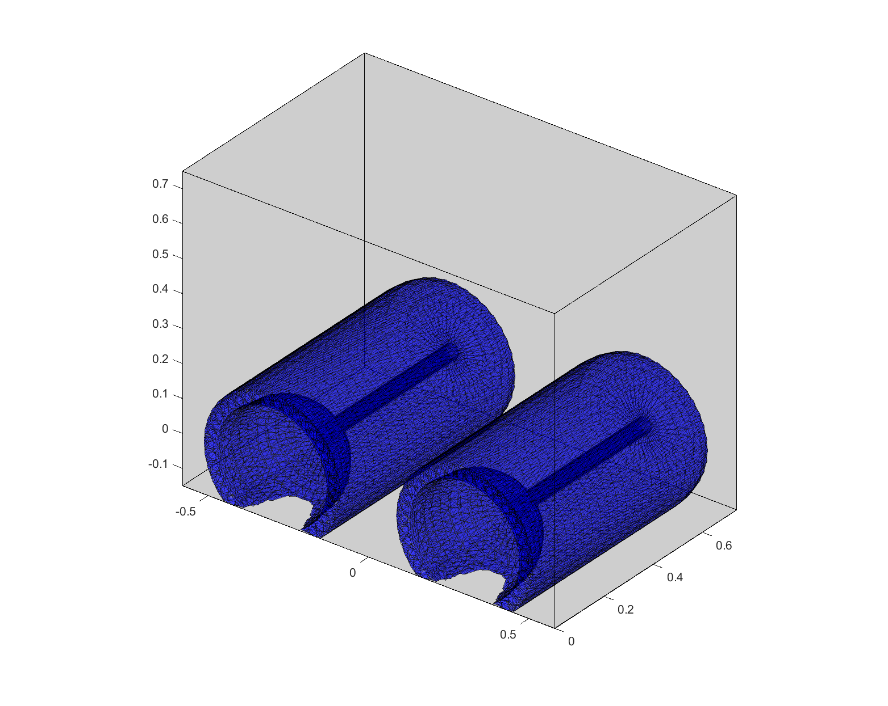

# NASA Valkyrie Forearm Redesign
### Glovebox Mobility Modeling and Optimization

This software models and optimizes the range of motion of various robotic arms.
It computes optimal geometric parameters for use in the team's effort to design glovebox-optimized forearms for NASA's Valkyrie humanoid robot.

__Matthew R. Bonanni__  
2018

