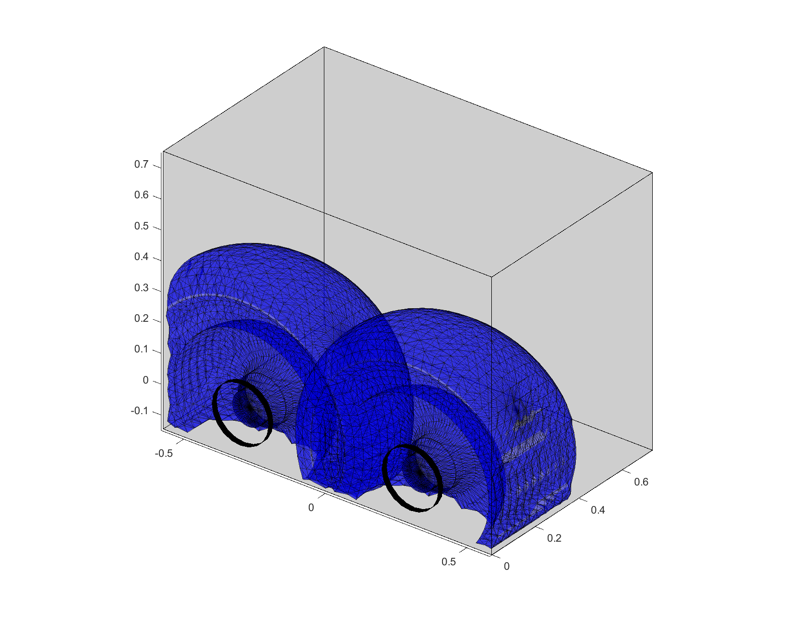

# NASA Valkyrie Forearm Redesign
### Glovebox Gamut Modeling and Optimization

This software models and optimizes the gamut (range of motion) of various robotic arms.
It computes optimal geometric parameters for use in the team's effort to design glovebox-optimized forearms for NASA's Valkyrie humanoid robot.

__Matthew R. Bonanni__  
2018

